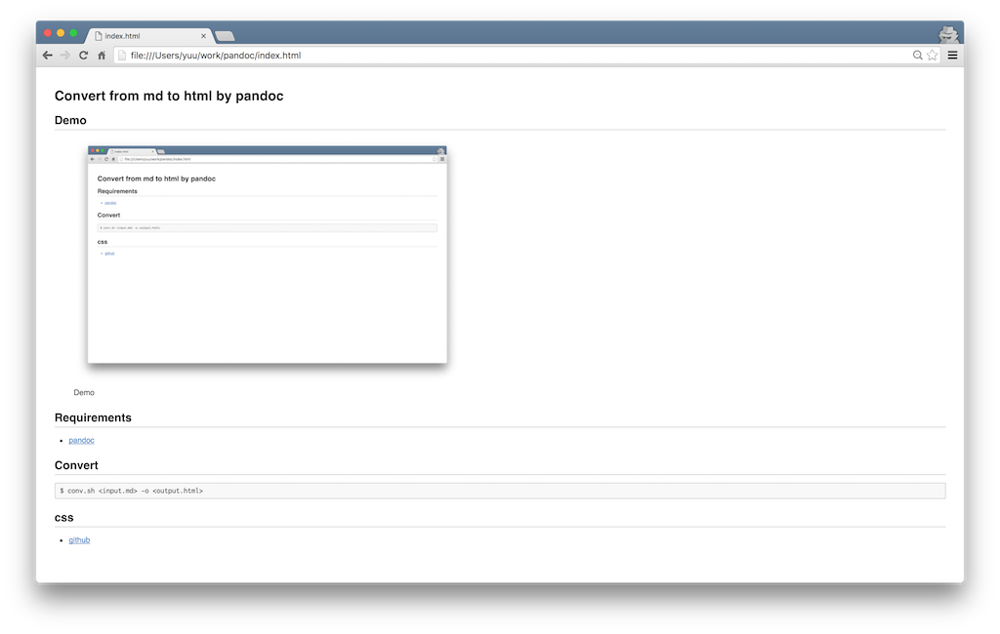

# Convert from md to html by pandoc

## [Demo](http://yuu3.github.io/pandoc-convert/)



## Requirements

- [pandoc](http://pandoc.org/)

## Convert

```
$ conv.sh <input.md> -o <output.html>
```

## Option

* 目次 : `--toc`

* 項番 : `-N`

## css

- [github](https://gist.github.com/griffin-stewie/9755783)
